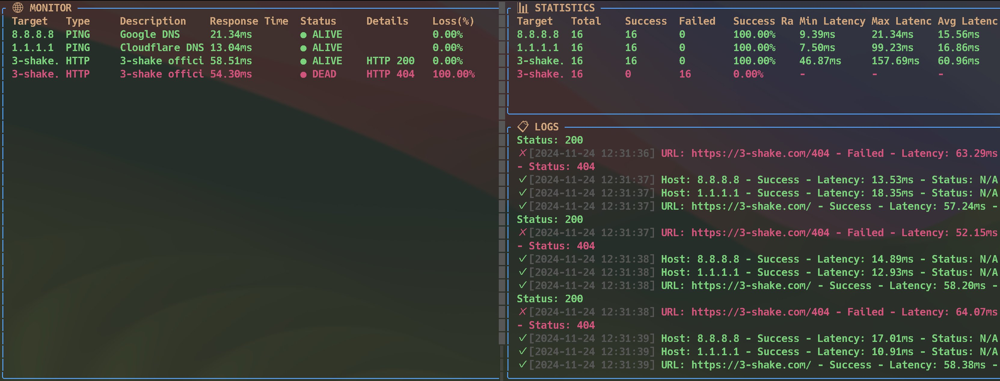

<div align="center">
  <div>
    
  </div>
</div>

# 🔍 exp - Terminal UI Network Monitor

## 🌟 Overview
A TUI-based network monitoring tool that can monitor both ping and HTTP endpoints with a beautiful, interactive interface.


## ✨ Features
- 🖥️ Beautiful Terminal UI with three panels:
  - 🌐 Monitor Panel: Real-time status monitoring
  - 📊 Statistics Panel: Detailed statistics for each target
  - 📋 Log Panel: Event logs with timestamps
- 🎯 Supports Multiple Target Types:
  - 🏓 PING monitoring
  - 🌍 HTTP endpoint monitoring
- 📐 Flexible Layout:
  - Resizable panels (Resize Mode)
  - Scrollable content
- 🎨 Color-coded Status:
  - ✅ Green: Healthy
  - ❌ Red: Error

## 🚀 Installation
```bash
cargo install --git https://github.com/nwiizo/exp
```

## 🛠️ Usage
Read config.toml in the current directory
```bash
exp 
```

## ⌨️ Key Bindings
- **Panel Navigation**
  - `Tab`: Switch between targets
  - `q`: Quit application

- **Layout Control**
  - `Ctrl+w`: Enter Resize Mode
  - In Resize Mode:
    - `h`: Decrease left panel width
    - `l`: Increase left panel width
    - `j`: Decrease top panel height
    - `k`: Increase top panel height
    - `Esc`: Exit Resize Mode

- **Scrolling**
  - Monitor Panel: `Shift + ↑/↓`
  - Statistics Panel: `Ctrl + ↑/↓`
  - Log Panel: `↑/↓` or `PageUp/PageDown`

## 📝 Configuration
Create a `config.toml` file:
```toml
[[targets]]
type = "ping"
host = "3-shake.com"
description = "3-shake.com ping check"

[[targets]]
type = "http"
url = "https://3-shake.com"
description = "3-shake.com HTTP check"
expected_status = 200
```
